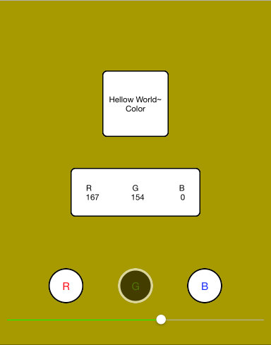
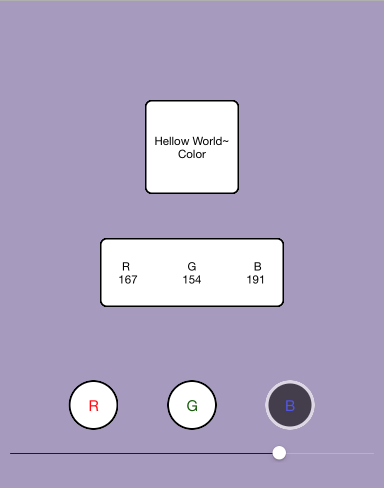
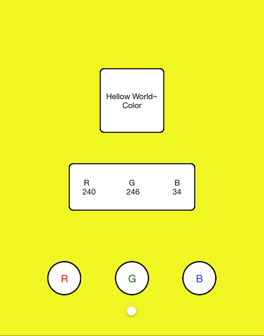

# colorHellowWord
## Use RGB , Value 0~255, show Color in the Screen.
## Introduction：

- 1.Touch Select Button. (There are three buttons, respectively R, G, B.)

    `// If you change R Button.`

- 2.Mobile Slider. The Slider value Will change to the Color's RGB Value.

    `// slider value range 0 to 255, and Slider Value just is equivalent R Value.`

- 3.The Screen will change Show Color.

    `// Tye selct other Button and moblie Slider. And observe the change of color on the screen.`

======================
## 正體中文版 - Traditional Chinese Language
## 說明：
## 使用RGB, 數值 0~255, 顯示顏色在畫面上.

- 1.選擇按鈕. (共有三個按鈕, 分別是按鈕 R, G, B.)

    `// 假如選擇的是 R 按鈕.`

- 2.滑動滑桿. 滑桿的值將改變顏色的RGB值.

    `// 滑桿的範圍值是0~255, 而目前滑桿的所滑動的數值就是 R 的值.`

- 3.畫面將顯示出所調變的顏色.

    `// 嘗試的選擇其他按鈕並移動滑桿. 觀察顯示在畫面上的顏色.`

===============

